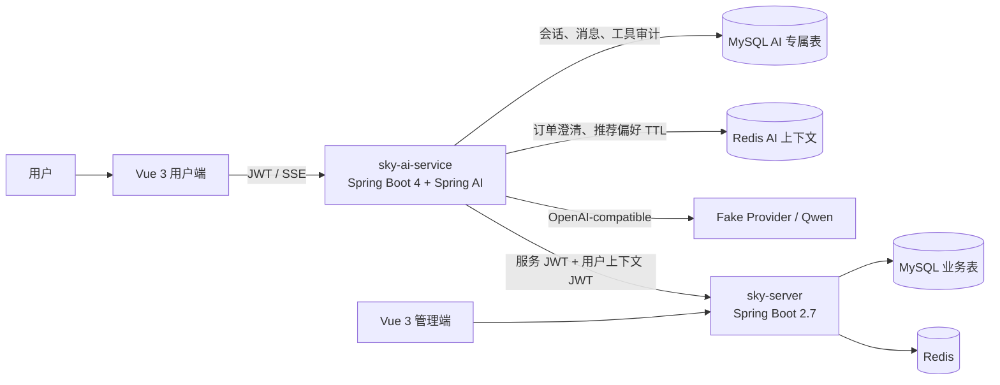

# 外卖智能客服与个性化菜品推荐 Agent

基于“苍穹外卖”业务系统扩展的智能客服 Agent 项目。用户前端采用 Web 页面，并使用 MinIO 替代阿里 OSS。项目目标是让大模型在受控权限下查询实时业务数据、理解多轮上下文，并结合用户偏好完成可解释的菜品推荐。

> [!IMPORTANT]
> 当前仓库处于 **功能型 PoC / MVP 骨架阶段**。门店状态、指定订单进度、会话持久化、三级意图路由、双 JWT、受控 Function Calling、SSE 基础链路，以及基于 Redis 会话偏好的确定性菜品/整餐推荐已经落地；RAG、模型原生 Token 流、人工转接、完整可观测性和上线级安全评测尚未实现。本文用 ✅、🟡、⬜ 明确标注完成度，避免将规划能力误认为现有功能。
>
> **欢迎Comment&Fork**

## 项目简介

传统客服系统通常依赖固定问答或关键词匹配，难以处理“这单到哪了”“换个便宜点的”一类带指代、省略和连续约束的表达。本项目在完整外卖业务系统之上新增独立 AI 服务，计划通过“规则识别 → 上下文解析 → LLM 决策”的三级路由连接订单、门店和菜品能力，同时将身份、资源范围和工具权限收敛在服务端。

当前版本已经能够：

- 验证用户 JWT，创建并查询属于当前用户的客服会话；
- 查询门店实时营业状态；
- 查询当前用户指定订单的进度，并在数据库层校验订单归属；
- 从用户文本或已验证的会话上下文中提取订单 ID，拒绝多 ID 和非法 ID，并支持下一轮补充订单号；
- 从多轮表达中增量提取预算、人数、辣度、甜度、偏好标签和过敏原，并保存为带 TTL 的 Redis 会话上下文；
- 通过业务服务完成可售菜品硬过滤、确定性排序和多人整餐组合，返回价格、数量及可解释原因码；
- 保存用户消息、助手消息、调用耗时、错误码和脱敏后的工具审计记录；
- 使用 Fake Provider 离线开发，或通过 OpenAI-compatible 协议接入 Qwen；
- 通过 SSE 返回稳定事件 ID，并结合请求幂等键支持事件级回放。

## 实现状态

图例：✅ 已实现 · 🟡 部分实现 · ⬜ 未实现

| 模块 | 状态 | 当前实现与边界 |
| --- | :---: | --- |
| 外卖基础业务 | ✅ | 用户登录、菜单、购物车、地址、下单、订单、店铺管理及管理端等基础能力 |
| Web 用户端智能客服 | ✅ | Vue 3 客服页、会话切换、历史加载、SSE 消费、失败重试 |
| MySQL 会话持久化 | ✅ | `ai_conversation`、`ai_message`、`ai_tool_call`，由 Flyway 管理 |
| 多轮上下文 | 🟡 | 读取 MySQL 最近 12 条已完成消息，维护已验证的关联订单，并用 Redis 保存待补订单号状态和结构化推荐偏好；尚无滚动摘要、Token 预算和多实体状态 |
| 三级意图路由 | 🟡 | 已有规则层、订单/推荐上下文层和 LLM 兜底；当前覆盖门店状态、订单进度、菜品推荐、退款边界及通用问答 |
| Function Calling | ✅ | 动态注册 `get_shop_status`、`get_order_progress`、`recommend_dishes`、`recommend_meal_combo` 四个只读白名单工具，每轮只暴露策略允许的能力 |
| 订单进度查询 | ✅ | `orderId + userId` 在业务查询层同时约束，越权订单与不存在订单统一返回 |
| 门店状态查询 | ✅ | 由 `sky-server` 读取 Redis；缺失或异常状态返回 `UNKNOWN` |
| 双 JWT 鉴权 | ✅ | 服务 JWT + 短期用户上下文 JWT；模型不能传入或改写 `userId` |
| 幂等与并发控制 | ✅ | 请求指纹、`clientRequestId`、唯一约束、会话行锁、消息/工具乐观锁 |
| SSE 流式响应 | 🟡 | 支持稳定事件 ID、`Last-Event-ID` 和幂等回放；当前为完整回答生成后的分块发送，并非模型原生 Token 流 |
| 调用审计与可观测性 | 🟡 | 已记录 Trace ID、模型元数据、耗时、状态和错误码；尚无指标看板、告警和完整安全事件体系 |
| Redis 热上下文 | 🟡 | 已保存待补订单号状态和会话级推荐偏好，默认 TTL 30 分钟；尚未缓存最近消息、滚动摘要、多焦点实体或热幂等状态 |
| 滚动摘要与 Token 预算 | ⬜ | 尚未实现动态摘要、Token 计数和预算化上下文组装 |
| 菜品偏好槽位抽取 | ✅ | 通过白名单规则增量抽取预算口径、人数、辣度、甜度、偏好/排除标签和过敏原，并对预算歧义与冲突条件进行澄清 |
| 菜品与整餐推荐 | 🟡 | 已实现起售/预算/标签/甜度/过敏原硬过滤、确定性评分、分类多样性和整餐组合；尚无 Embedding/RAG 语义召回和离线效果评测 |
| Embedding / 向量库 | ⬜ | 尚未建立菜品向量索引、增量更新和召回评测 |
| 推荐结果实时校验 | ✅ | 每次推荐都由 `sky-server` 实时查询起售且具有完整画像的菜品，并在返回前应用预算和安全约束；不是离线缓存结果 |
| 更多业务工具 | ⬜ | `search_menu`、`get_recent_orders`、`get_order_detail`、`create_handoff` 尚未实现 |
| 人工客服转接 | ⬜ | 尚未实现工单、优先级、会话接管状态机及管理端处理页面 |
| 限流、熔断与降级 | ⬜ | 已配置 HTTP 超时和安全错误模型，但尚无完整限流、熔断和自动降级策略 |

## 系统架构



关键边界：

- `sky-ai-service` 只直接读写 AI 专属表和 AI 命名空间的短期 Redis 上下文，不直接查询订单、菜品等交易表；
- 业务事实必须通过 `sky-server` 的内部白名单接口获得；
- 用户身份来自已验证的外部 JWT，工具 Schema 中不暴露 `userId`；
- 订单查询在 Mapper/Service 层同时限制订单 ID 和当前用户 ID；
- 模型只能看到本轮策略允许的工具，不能访问 SQL、任意 URL、密钥或内部实现。

## 核心链路

### 1. 三级意图路由

1. **规则层**：高精度识别门店状态、订单进度、菜品推荐、退款表达和订单 ID。
2. **上下文层**：结合当前会话已验证的 `related_order_id`、Redis 待补参数/推荐偏好和最近消息，处理“这单”“19”“换个便宜点的”等追问。
3. **LLM 层**：前两层无法确定时交给模型，但最终仍由策略引擎决定可见工具。

退款属于未授权写操作，当前直接返回固定能力边界，不向模型开放退款工具。

### 2. 受控 Function Calling

当前开放四个只读工具：

| 工具 | 用途 | 安全约束 |
| --- | --- | --- |
| `get_shop_status` | 查询门店此刻是否营业 | 仅返回 `OPEN`、`CLOSED`、`UNKNOWN` |
| `get_order_progress` | 查询指定订单进度和允许操作 | 订单 ID 由服务端绑定，用户 ID 来自认证上下文 |
| `recommend_dishes` | 按单菜/人均预算与偏好推荐菜品 | 参数来自服务端维护的结构化偏好；业务服务执行实时硬过滤与确定性排序 |
| `recommend_meal_combo` | 按总预算和人数生成整餐组合 | 总价不超过预算，过敏原等安全约束不可被模型放宽 |

每次调用都会生成脱敏审计记录；同一轮重复选择相同工具只执行一次。

### 3. 会话、幂等与恢复

- MySQL 保存完整用户/助手消息以及工具调用状态；
- 会话行锁为消息分配严格递增的 `sequence_no`；
- `clientRequestId + SHA-256 请求指纹` 防止重复提交及幂等键被不同载荷复用；
- 助手消息通过 `reply_to_message_id` 与用户消息建立一对一回复关系；
- 消息和工具状态更新使用乐观锁；
- SSE 事件 ID 基于持久化消息 ID 生成，重连时复用 `clientRequestId` 并携带 `Last-Event-ID`。

## 技术栈

| 层次 | 当前技术 |
| --- | --- |
| AI 服务 | Java 21、Spring Boot 4.1、Spring AI 2.0、JDBC、Flyway |
| 业务服务 | Java、Spring Boot 2.7、MyBatis、MySQL、Redis、JWT、WebSocket |
| 模型接入 | Qwen OpenAI-compatible API、Function Calling、离线 Fake Provider |
| 用户端 | Vue 3、TypeScript、Vite、Pinia、Axios、Fetch SSE |
| 管理端 | Vue 3、TypeScript、Vite、Element Plus、ECharts |
| 测试 | JUnit 5、MockMvc、Mockito、Testcontainers、MySQL 8 |
| 规划引入 | RAG、Embedding、向量检索、滚动摘要、完整评测与人工转接 |

## 目录结构

```text
sky-take-out/
├─ sky-ai-service/              # 独立 AI 客服服务（Java 21，单独构建）
├─ sky-server/                  # 外卖业务服务与 AI 内部工具接口
├─ sky-common/                  # 公共常量、异常、工具类
├─ sky-pojo/                    # Entity / DTO / VO
├─ sky-web-user/                # Vue 3 用户端，包含智能客服页面
├─ project-sky-admin-vue-ts/    # Vue 3 管理端
├─ docs/                        # Agent 设计、P0 规格、持久化设计
└─ sql/                         # 增量业务 SQL
```

> `sky-ai-service` 使用独立 POM，不在仓库根 Maven reactor 中，需要单独构建和启动。

## 本地运行

### 环境要求

- JDK 21（运行 AI 服务；也可用于构建当前业务服务）
- Maven 3.9+
- MySQL 8.0+
- Redis 6+
- Node.js 22+ 与 npm
- Docker（仅运行包含 Testcontainers 的 AI 集成测试时需要）

### 1. 准备数据与配置

先导入苍穹外卖基础数据库，并按需执行 `sql/` 中的增量脚本。业务服务的本地数据源、Redis、对象存储等配置位于 `sky-server/src/main/resources/application-dev.yml`。

开发配置中存在便于本地联调的示例凭据。公开部署前必须改为环境变量或密钥管理系统注入，并轮换所有已暴露的数据库、JWT、对象存储和第三方服务凭据。

AI 服务至少需要以下配置：

```powershell
$env:AI_DB_URL="jdbc:mysql://localhost:3306/sky_take_out?serverTimezone=Asia/Shanghai&useUnicode=true&characterEncoding=utf8&useSSL=false&allowPublicKeyRetrieval=true"
$env:AI_DB_USERNAME="root"
$env:AI_DB_PASSWORD="<your-password>"

# AI 服务：与 sky-server 的用户 JWT、内部服务 JWT 配置保持一致
$env:APP_AUTH_USER_JWT_SECRET="<user-jwt-secret>"
$env:APP_AUTH_SERVICE_JWT_SECRET="<service-secret-at-least-32-bytes>"
$env:APP_AUTH_USER_CONTEXT_JWT_SECRET="<different-context-secret-at-least-32-bytes>"

# sky-server 对应配置
$env:SKY_JWT_USER_SECRET_KEY=$env:APP_AUTH_USER_JWT_SECRET
$env:SKY_AI_INTERNAL_SERVICE_SECRET_KEY=$env:APP_AUTH_SERVICE_JWT_SECRET
$env:SKY_AI_INTERNAL_USER_CONTEXT_SECRET_KEY=$env:APP_AUTH_USER_CONTEXT_JWT_SECRET
```

如果 AI 表尚未由 Flyway 接管，首次连接已有非空业务库时临时设置：

```powershell
$env:AI_FLYWAY_BASELINE_ON_MIGRATE="true"
```

首次迁移成功后应移除该变量，避免在生产环境长期开启自动基线。

### 2. 启动业务服务

```powershell
mvn -pl sky-server -am spring-boot:run
```

默认端口为 `8080`。

### 3. 启动 AI 服务

默认使用不联网的 Fake Provider：

```powershell
mvn -f sky-ai-service/pom.xml spring-boot:run
```

切换到 Qwen：

```powershell
$env:SPRING_PROFILES_ACTIVE="qwen"
$env:AI_API_KEY="<your-api-key>"
$env:AI_CHAT_MODEL="qwen3.7-plus"
$env:AI_MODEL_BASE_URL="https://dashscope.aliyuncs.com/compatible-mode/v1"
mvn -f sky-ai-service/pom.xml spring-boot:run
```

AI 服务默认端口为 `8081`，健康检查地址为 `http://localhost:8081/actuator/health`。

### 4. 启动用户端

```powershell
Set-Location sky-web-user
npm install
npm run dev
```

用户端默认运行在 `http://localhost:5173`，开发代理将普通业务请求转发到 `8080`，将 AI 请求转发到 `8081`。

## API 概览

所有 AI 接口均通过 `authentication` 请求头接收现有用户 JWT。

```text
POST /api/ai/conversations
GET  /api/ai/conversations?limit=20&offset=0
GET  /api/ai/conversations/{conversationId}
GET  /api/ai/conversations/{conversationId}/messages?afterSequence=0&limit=50
POST /api/ai/conversations/{conversationId}/messages/stream
POST /api/ai/poc/chat
```

SSE 请求示例：

```http
POST /api/ai/conversations/{conversationId}/messages/stream
authentication: <user-jwt>
Content-Type: application/json
Accept: text/event-stream

{
  "message": "订单 101 到哪了？",
  "clientRequestId": "web-20260830-001"
}
```

事件类型包括 `message.delta`、`message.completed` 和 `error`。

## 测试

运行 AI 服务测试：

```powershell
mvn -f sky-ai-service/pom.xml test
```

当前 AI 服务测试覆盖 JWT、工具单次执行、Agent 策略、订单补参、推荐偏好抽取、推荐上下文、数据库迁移、用户归属、幂等、乐观锁、会话 API 和 SSE 回放。2026-08-31 本地验证结果：**51 tests，0 failures，0 errors**。

业务服务测试：

```powershell
mvn -pl sky-server -am test
```

当前验证基线：

| 范围 | 2026-08-31 本地结果 | 说明 |
| --- | --- | --- |
| `sky-ai-service` | ✅ 51 tests 通过 | 包含 Testcontainers + MySQL 8 的 Flyway/持久化集成测试 |
| `sky-server` 的 AI 相关测试 | ✅ 19 tests 通过 | 覆盖内部接口鉴权、订单归属契约、门店状态、菜品与整餐推荐 |
| `sky-web-user` | ✅ `npm run build` 通过 | TypeScript 检查与 Vite 生产构建通过 |
| `project-sky-admin-vue-ts` | 🟡 Vite 构建通过，独立 `type-check` 未通过 | 仍有 Vue 兼容层、ECharts 类型和旧类组件类型问题 |

根项目完整测试还包含依赖本机 Redis 和外部网络的历史示例测试；未配置这些依赖时会出现 5 个环境错误。它们不属于 Agent 测试，但仍应在接入 CI 前改为可隔离的集成测试或默认跳过。

## 路线图

- [ ] 新增 `search_menu`、`get_recent_orders`、`get_order_detail` 和 `create_handoff` 工具
- [x] 使用 Redis 保存短期结构化推荐偏好和待补订单号状态
- [ ] 使用 Redis 缓存最近消息、滚动摘要、多焦点实体和热幂等状态
- [ ] 基于 Token 预算动态选择最近消息、摘要、偏好、业务实体和检索片段
- [x] 使用确定性白名单规则抽取预算、人数、辣度、甜度、标签和过敏原等偏好槽位
- [x] 实现实时 SQL 硬约束过滤、确定性重排、单菜推荐和多人整餐组合
- [ ] 引入 Embedding/RAG 语义召回，并与现有硬过滤和确定性重排组合
- [ ] 完善“换个便宜点的”“和刚才不一样”等推荐追问与候选去重
- [ ] 接入模型原生 Token 流，并持久化可跨实例恢复的 SSE 事件
- [ ] 实现人工转接、接管状态机、风险分级和管理端工单页面
- [ ] 增加限流、熔断、指标看板、告警、Prompt Injection 安全评测和离线推荐评测

详细设计参见：

- [`docs/ai-customer-service-agent-design.md`](docs/ai-customer-service-agent-design.md)
- [`docs/ai-customer-service-p0-spec.md`](docs/ai-customer-service-p0-spec.md)
- [`docs/ai-customer-service-p0-implementation-plan.md`](docs/ai-customer-service-p0-implementation-plan.md)
- [`docs/ai-customer-service-persistence-schema-design.md`](docs/ai-customer-service-persistence-schema-design.md)

## License

本项目采用 [Apache License 2.0](LICENSE)。
